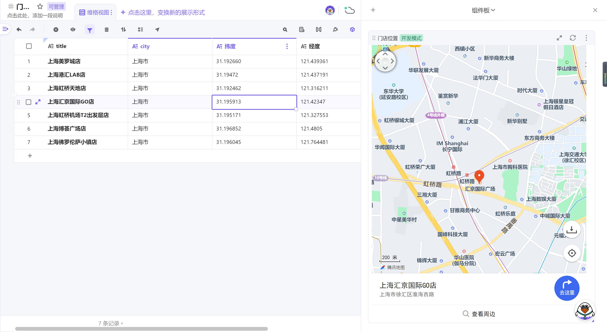

# 维格小程序 - 腾讯地图定位

一款基于腾讯地图，实现坐标点显示和路线导航的维格小程序

## 🎨 介绍

 

**已经实现的功能特性：**

- [x] 集成腾讯地图的位置展示组件，当鼠标点击任意一行时，自动读取单元格里的经度和纬度，并把标题显示到位置展示组件里。

 

**正在规划/迭代的功能：**
- [ ] 基于浏览器能力，获取当前的经纬度，然后写到维格表里

## 🎯 更新日志

2022年01月11日

- 初始化工程
